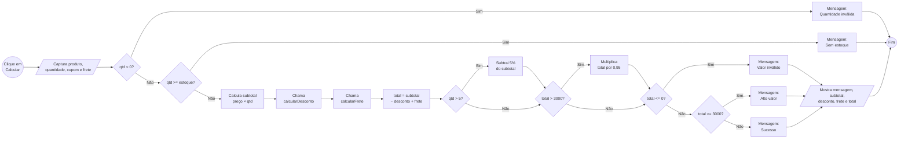
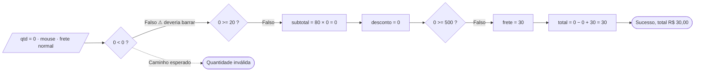
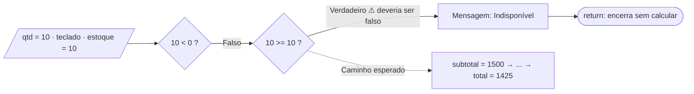
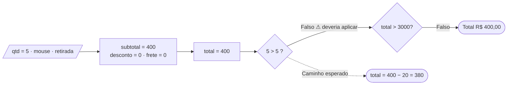
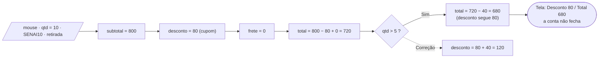
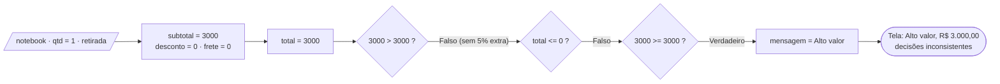
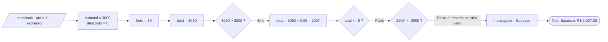

# Teste de Caixa Branca – Loja SENAI

## Capa

| Campo | Informação |
|---|---|
| **Instituição** | SENAI |
| **Curso** | Técnico em Desenvolvimento de Sistemas |
| **Unidade curricular** | SESI CE 356 |
| **Atividade** | Teste de Caixa Branca – Sistema de Pedidos |
| **Aluno** | Ítalo Mozer de Sousa |
| **Turma** | 3A |
| **Professores** | Robson, Reenye e Wellington |
| **Data** | 30/09/2026 |

---

## 1. Contextualização sobre Teste de Caixa Branca

No teste de caixa branca, em vez de observar apenas o que entra e o que sai, eu abro o código e examino a lógica interna. O objetivo é percorrer cada `if`, cada comparação e cada caminho possível, verificando se o programa se comporta como deveria em todos eles. Esse tipo de teste revela falhas que um uso comum não mostra, principalmente as que surgem em casos específicos, como um valor exatamente igual ao limite de uma regra.

### O sistema analisado

O sistema é uma página simples em que o usuário seleciona um produto, informa a quantidade, pode aplicar um cupom e escolhe o tipo de frete. Ao clicar em "Calcular pedido", a tela exibe subtotal, desconto, frete e total. O projeto tem três arquivos (`index.html`, `style.css` e `script.js`), e toda a lógica fica no `script.js`.

<details>
<summary><b>Código original (script.js)</b></summary>

```js
const precos = {
  notebook: 3000,
  mouse: 80,
  teclado: 150
};

const estoque = {
  notebook: 5,
  mouse: 20,
  teclado: 10
};

const produto = document.getElementById("produto");
const quantidade = document.getElementById("quantidade");
const cupom = document.getElementById("cupom");
const frete = document.getElementById("frete");
const calcular = document.getElementById("calcular");
const resultado = document.getElementById("resultado");

function calcularDesconto(subtotal, codigo) {
  if (codigo === "SENAI10") {
    return subtotal * 0.10;
  }

  if (codigo === "SENAI20" && subtotal >= 1000) {
    return subtotal * 0.20;
  }

  return 0;
}

function calcularFrete(tipo, subtotal) {
  if (tipo === "retirada") {
    return 0;
  }

  if (tipo === "expresso") {
    return 60;
  }

  if (subtotal >= 500) {
    return 0;
  }

  return 30;
}

function finalizarPedido() {
  const produtoSelecionado = produto.value;
  const qtd = Number(quantidade.value);
  const codigo = cupom.value.trim().toUpperCase();

  if (qtd < 0) {
    resultado.innerHTML = "<p>Quantidade inválida.</p>";
    return;
  }

  if (qtd >= estoque[produtoSelecionado]) {
    resultado.innerHTML = "<p>Quantidade indisponível em estoque.</p>";
    return;
  }

  const subtotal = precos[produtoSelecionado] * qtd;
  const desconto = calcularDesconto(subtotal, codigo);
  const valorFrete = calcularFrete(frete.value, subtotal);

  let total = subtotal - desconto + valorFrete;

  if (qtd > 5) {
    total = total - subtotal * 0.05;
  }

  if (total > 3000) {
    total = total * 0.95;
  }

  let mensagem = "Pedido calculado com sucesso.";

  if (total <= 0) {
    mensagem = "Valor do pedido inválido.";
  } else if (total >= 3000) {
    mensagem = "Pedido de alto valor.";
  }

  resultado.innerHTML = `
    <p>${mensagem}</p>
    <p>Subtotal: R$ ${subtotal.toFixed(2)}</p>
    <p>Desconto: R$ ${desconto.toFixed(2)}</p>
    <p>Frete: R$ ${valorFrete.toFixed(2)}</p>
    <p class="total">Total: R$ ${total.toFixed(2)}</p>
  `;
}

calcular.addEventListener("click", finalizarPedido);
```
</details>

### Como defini o comportamento esperado

| Item | Regra que considero correta |
|---|---|
| Quantidade | Número inteiro maior que zero |
| Estoque | É permitido pedir até o total em estoque, inclusive |
| Cupom `SENAI10` | Abate 10% do subtotal |
| Cupom `SENAI20` | Abate 20% do subtotal, apenas se ele for de R$ 1.000 ou mais |
| Desconto por quantidade | Abate 5% do subtotal a partir de 5 unidades |
| Frete | Retirada é grátis; expresso custa R$ 60; normal custa R$ 30, ou é grátis com subtotal a partir de R$ 500 |
| Pedido de alto valor | Total a partir de R$ 3.000 recebe 5% extra de desconto e a mensagem "Pedido de alto valor" |
| Exibição | Subtotal − descontos + frete deve resultar no total mostrado na tela |

---

## 2. Análise das Estruturas de Decisão

O código usa somente `if`. Não há `switch`, operador ternário nem laço de repetição, e o único operador lógico presente é o `&&` do cupom SENAI20.

| Código | Função | Condição avaliada | Se verdadeiro | Se falso |
|---|---|---|---|---|
| D1 | `calcularDesconto` | `codigo === "SENAI10"` | Desconto de 10% | Segue para D2 |
| D2 | `calcularDesconto` | `codigo === "SENAI20" && subtotal >= 1000` | Desconto de 20% | Sem desconto |
| D3 | `calcularFrete` | `tipo === "retirada"` | Frete R$ 0 | Segue para D4 |
| D4 | `calcularFrete` | `tipo === "expresso"` | Frete R$ 60 | Segue para D5 |
| D5 | `calcularFrete` | `subtotal >= 500` | Frete R$ 0 | Frete R$ 30 |
| D6 | `finalizarPedido` | `qtd < 0` | "Quantidade inválida" | Segue para D7 |
| D7 | `finalizarPedido` | `qtd >= estoque[produto]` | "Indisponível" | Continua o cálculo |
| D8 | `finalizarPedido` | `qtd > 5` | Aplica 5% | Não aplica |
| D9 | `finalizarPedido` | `total > 3000` | Aplica 5% extra | Não aplica |
| D10 | `finalizarPedido` | `total <= 0` | "Valor inválido" | Segue para D11 |
| D11 | `finalizarPedido` | `total >= 3000` | "Alto valor" | "Sucesso" |

---

## 3. Fluxograma do Exemplo

O diagrama abaixo mostra o fluxo completo do sistema, desde o clique no botão até a exibição do resultado.



---

## 4. Casos de Teste

Elaborei um caso de teste para cada erro encontrado.

| ID | Dados de entrada | Decisões exercitadas | Resultado esperado |
|---|---|---|---|
| CT01 | Mouse, quantidade 0, sem cupom, frete normal | D6 falso, D7 falso, cálculo segue | "Quantidade inválida" |
| CT02 | Teclado, quantidade 10 (igual ao estoque), sem cupom, retirada | D6 falso, D7 no limite | Pedido aceito, total R$ 1.425,00 |
| CT03 | Mouse, quantidade 5, sem cupom, retirada | D8 com qtd = 5 (limite) | Desconto de R$ 20,00 e total de R$ 380,00 |
| CT04 | Mouse, quantidade 10, cupom SENAI10, retirada | D1 verdadeiro, D8 verdadeiro | Desconto exibido de R$ 120,00 e total de R$ 680,00 |
| CT05 | Notebook, quantidade 1, sem cupom, retirada (total 3000) | D9 e D11 com total = 3000 | 5% extra, total R$ 2.850,00, "Pedido de alto valor." |
| CT06 | Notebook, quantidade 1, sem cupom, frete expresso (total 3060) | D9 verdadeiro e depois D11 | "Pedido de alto valor." com total R$ 2.907,00 |

---

## 5. Resultados dos Testes

Rodei os casos em Node.js usando a mesma lógica do `script.js`, primeiro na versão original e depois na corrigida.

### Antes da correção

| Teste | Entrada | Esperado | Obtido | Status |
|---|---|---|---|---|
| CT01 | Mouse, 0, sem cupom, normal | Quantidade inválida | "Pedido calculado com sucesso", total R$ 30,00 | ❌ Falhou |
| CT02 | Teclado, 10, sem cupom, retirada | Aceito, total R$ 1.425,00 | "Quantidade indisponível em estoque" | ❌ Falhou |
| CT03 | Mouse, 5, sem cupom, retirada | Total R$ 380,00 | Total R$ 400,00, sem desconto | ❌ Falhou |
| CT04 | Mouse, 10, SENAI10, retirada | Desconto R$ 120,00 e total R$ 680,00 | Desconto R$ 80,00 e total R$ 680,00 | ❌ Falhou |
| CT05 | Notebook, 1, sem cupom, retirada | Total R$ 2.850,00 e alto valor | Total R$ 3.000,00 e "alto valor" | ❌ Falhou |
| CT06 | Notebook, 1, sem cupom, expresso | Alto valor, total R$ 2.907,00 | "Pedido calculado com sucesso", total R$ 2.907,00 | ❌ Falhou |

### Depois da correção

| Teste | Saída do sistema corrigido | Status |
|---|---|---|
| CT01 | "Quantidade inválida." | ✅ Passou |
| CT02 | Subtotal 1500,00; desconto 75,00; frete 0; total 1425,00 | ✅ Passou |
| CT03 | Subtotal 400,00; desconto 20,00; total 380,00 | ✅ Passou |
| CT04 | Subtotal 800,00; desconto 120,00; total 680,00 | ✅ Passou |
| CT05 | Desconto de alto valor 150,00; total 2850,00; "Pedido de alto valor." | ✅ Passou |
| CT06 | Desconto de alto valor 153,00; total 2907,00; "Pedido de alto valor." | ✅ Passou |

---

## 6. Análise dos Resultados

Foram encontrados seis erros de lógica. Para cada um, descrevo o caminho que o programa percorreu.

---

### ERRO 1

**Nível:** Fácil
**Técnica utilizada:** análise de valores-limite

**Trecho do código:**
```js
if (qtd < 0) {
  resultado.innerHTML = "<p>Quantidade inválida.</p>";
  return;
}
```

**Comportamento esperado:** quantidade zero, campo vazio ou número decimal (como 2,5) deveriam ser rejeitados.

**Dados do teste:** mouse, quantidade 0, sem cupom, frete normal.

**Caminho percorrido:** `Number("0")` resulta em 0. Em D6, `0 < 0` é falso, então a validação não barra. Em D7, `0 >= 20` é falso. O subtotal e o desconto ficam em 0, e em D5 `0 >= 500` é falso, logo o frete é 30. O total passa a ser 30, e D8, D9, D10 e D11 resultam em falso, chegando à mensagem de sucesso.

**Resultado esperado:** "Quantidade inválida".

**Resultado obtido:** "Pedido calculado com sucesso", com subtotal R$ 0,00, frete R$ 30,00 e total R$ 30,00. O cliente pagaria frete sem comprar nenhum item.

**Erro identificado:** o limite está incorreto. Com `< 0`, o zero passa, justamente o primeiro valor inválido. Um campo vazio também é convertido em 0 e números decimais também são aceitos.

**Correção realizada:**
```js
if (!Number.isInteger(qtd) || qtd <= 0) {
```

**Resultado após a correção:** "Quantidade inválida".

**Fluxograma:**


---

### ERRO 2

**Nível:** Fácil
**Técnica utilizada:** análise de valores-limite

**Trecho do código:**
```js
if (qtd >= estoque[produtoSelecionado]) {
  resultado.innerHTML = "<p>Quantidade indisponível em estoque.</p>";
  return;
}
```

**Comportamento esperado:** havendo 10 teclados em estoque, deve ser possível comprar os 10.

**Dados do teste:** teclado (estoque 10), quantidade 10, sem cupom, retirada.

**Caminho percorrido:** D6 (`10 < 0`) é falso. Em D7, `10 >= 10` é verdadeiro, então o programa exibe "indisponível" e encerra com `return`, sem calcular nada.

**Resultado esperado:** pedido aceito, com subtotal 1500,00, desconto 75,00 e total 1425,00.

**Resultado obtido:** "Quantidade indisponível em estoque".

**Erro identificado:** o `>=` impede exatamente o pedido que usa todo o estoque. O operador correto é `>`. Por causa disso, o notebook (estoque 5) jamais poderia ser comprado em 5 unidades.

**Correção realizada:**
```js
if (qtd > estoque[produtoSelecionado]) {
```

**Resultado após a correção:** o pedido é aceito, com total R$ 1.425,00. Também testei a quantidade 11, que continua retornando "Quantidade indisponível em estoque."

**Fluxograma:**


---

### ERRO 3

**Nível:** Médio
**Técnica utilizada:** valores-limite e cobertura de decisões

**Trecho do código:**
```js
if (qtd > 5) {
  total = total - subtotal * 0.05;
}
```

**Comportamento esperado:** o desconto de 5% vale a partir de 5 unidades.

**Dados do teste:** mouse, quantidade 5, sem cupom, retirada.

**Caminho percorrido:** D6 é falso e D7 (`5 >= 20`) é falso. O subtotal é 400, o desconto é 0, o frete é 0 e o total é 400. Em D8, `5 > 5` é falso, portanto o desconto não é aplicado. D9, D10 e D11 resultam em falso e a saída é "Sucesso".

**Resultado esperado:** desconto de R$ 20,00 e total de R$ 380,00.

**Resultado obtido:** total de R$ 400,00, sem desconto.

**Erro identificado:** o `>` exclui exatamente a quantidade que inicia a faixa de desconto. O correto é `>=`.

**Correção realizada:**
```js
const QTD_MINIMA_DESCONTO = 5;

if (qtd >= QTD_MINIMA_DESCONTO) {
  desconto += subtotal * 0.05;
}
```

**Resultado após a correção:** total R$ 380,00. Com 4 unidades continua sem desconto, como deve ser.

**Fluxograma:**


---

### ERRO 4

**Nível:** Médio
**Técnica utilizada:** rastreamento de variáveis

**Trecho do código:**
```js
const desconto = calcularDesconto(subtotal, codigo);
let total = subtotal - desconto + valorFrete;

if (qtd > 5) {
  total = total - subtotal * 0.05;
}

resultado.innerHTML = `
  <p>Desconto: R$ ${desconto.toFixed(2)}</p>
`;
```

**Comportamento esperado:** o desconto exibido deve ser a soma de todos os descontos aplicados (cupom e quantidade), para que subtotal − desconto + frete resulte no total.

**Dados do teste:** mouse, quantidade 10, cupom SENAI10, retirada.

**Caminho percorrido:** o subtotal é 800. Em D1 o cupom é válido, então `desconto` = 80. O frete é 0 e o total é 800 − 80 = 720. Em D8, `10 > 5` é verdadeiro e o total passa a 720 − 40 = 680. Porém a variável `desconto` continua valendo 80.

**Resultado esperado:** desconto de R$ 120,00 (80 + 40) e total de R$ 680,00.

**Resultado obtido:** subtotal 800,00, desconto 80,00, frete 0,00 e total 680,00. Quem confere a conta na tela encontra 800 − 80 = 720 e não entende por que o total é 680.

**Erro identificado:** o desconto por quantidade altera diretamente o `total` e nunca entra na variável `desconto`. O valor exibido e o valor usado no cálculo ficam diferentes, e um desconto concedido ao cliente fica oculto.

**Correção realizada:**
```js
let desconto = calcularDesconto(subtotal, codigo);

if (qtd >= QTD_MINIMA_DESCONTO) {
  desconto += subtotal * 0.05;
}

const totalParcial = subtotal - desconto + valorFrete;
```

**Resultado após a correção:** desconto de R$ 120,00 e total de R$ 680,00.

**Fluxograma:**


---

### ERRO 5

**Nível:** Difícil
**Técnica utilizada:** análise de condições e limites entre decisões dependentes

**Trecho do código:**
```js
if (total > 3000) {
  total = total * 0.95;
}

if (total <= 0) {
  mensagem = "Valor do pedido inválido.";
} else if (total >= 3000) {
  mensagem = "Pedido de alto valor.";
}
```

**Comportamento esperado:** o mesmo limite deve valer para o desconto extra e para a mensagem de alto valor. Adotei "a partir de R$ 3.000".

**Dados do teste:** notebook, quantidade 1, sem cupom, retirada. O total fica exatamente em 3000.

**Caminho percorrido:** o subtotal é 3000, o desconto é 0 e o frete é 0, então o total é 3000. D8 é falso. Em D9, `3000 > 3000` é falso, portanto não há desconto extra. D10 é falso. Em D11, `3000 >= 3000` é verdadeiro e a mensagem é "Alto valor".

**Resultado esperado:** "Pedido de alto valor." com o 5% extra, total de R$ 2.850,00.

**Resultado obtido:** "Pedido de alto valor." com total de R$ 3.000,00.

**Erro identificado:** duas decisões testam o mesmo limite com operadores diferentes (`>` e `>=`). Com o total em 3000, o pedido é classificado como alto valor, mas não recebe o benefício. O erro só aparece exatamente nesse valor, por isso passa despercebido com facilidade.

**Correção realizada:** uma constante única e a mesma comparação nos dois pontos.
```js
const LIMITE_ALTO_VALOR = 3000;

const altoValor = totalParcial >= LIMITE_ALTO_VALOR;
```

**Resultado após a correção:** total de R$ 2.850,00 e "Pedido de alto valor".

**Fluxograma:**


---

### ERRO 6

**Nível:** Difícil
**Técnica utilizada:** análise de caminhos e rastreamento de variáveis

**Trecho do código:**
```js
if (total > 3000) {
  total = total * 0.95;
}

if (total <= 0) {
  mensagem = "Valor do pedido inválido.";
} else if (total >= 3000) {
  mensagem = "Pedido de alto valor.";
}
```

**Comportamento esperado:** a classificação de alto valor deve considerar o valor do pedido antes do desconto extra que ele próprio gera.

**Dados do teste:** notebook, quantidade 1, sem cupom, frete expresso (R$ 60).

**Caminho percorrido:** o subtotal é 3000 e o desconto é 0. Em D4 o frete expresso vale 60, então o total é 3060. D8 é falso. Em D9, `3060 > 3000` é verdadeiro e o total passa a 3060 × 0,95 = 2907. Em D10, o resultado é falso. Em D11, `2907 >= 3000` é falso e a mensagem sai como "Sucesso".

**Resultado esperado:** "Pedido de alto valor." com total de R$ 2.907,00.

**Resultado obtido:** "Pedido calculado com sucesso." com total de R$ 2.907,00.

**Erro identificado:** ordem das operações. O desconto extra reduz `total` e, logo em seguida, a mesma variável é usada para classificar o pedido. Qualquer pedido entre R$ 3.000,00 e cerca de R$ 3.157,89 recebe o desconto, cai abaixo de 3000 e perde a classificação. Uma decisão altera o dado que a decisão seguinte vai usar.

**Correção realizada:** definir se é alto valor antes de alterar o total e usar essa definição na mensagem.
```js
const altoValor = totalParcial >= LIMITE_ALTO_VALOR;
const descontoAltoValor = altoValor ? totalParcial * 0.05 : 0;
const total = totalParcial - descontoAltoValor;

if (total <= 0) {
  mensagem = "Valor do pedido inválido.";
} else if (altoValor) {
  mensagem = "Pedido de alto valor.";
}
```

**Resultado após a correção:** "Pedido de alto valor." e total de R$ 2.907,00.

**Fluxograma:**


---

### Comparação antes e depois

| Erro | Nível | Situação anterior | Situação corrigida |
|---|---|---|---|
| 1 | Fácil | Aceitava quantidade 0 e cobrava frete | Recusa 0, vazio e decimais |
| 2 | Fácil | Bloqueava pedido igual ao estoque | Aceita até o estoque e bloqueia acima |
| 3 | Médio | 5 unidades ficavam sem desconto | Desconto a partir de 5 unidades |
| 4 | Médio | Desconto exibido não fechava com o total | Desconto exibido soma cupom e quantidade |
| 5 | Difícil | `>` e `>=` divergiam em 3000 | Mesmo limite nas duas decisões |
| 6 | Difícil | Perdia "alto valor" após o desconto | Classificação definida antes do desconto |

### Cobertura

Os seis casos percorrem D1, D6, D7, D8, D9, D10 (lado falso), D11 (os dois lados) e parte da condição composta D2. Para cobrir o restante, ainda seria necessário testar o cupom SENAI20 com subtotal acima e abaixo de R$ 1.000, o frete normal acima e abaixo de R$ 500 e um cupom inexistente.

### Código corrigido

O arquivo completo está em [`scriptnovo.js`](./scriptnovo.js). Abaixo, a função `finalizarPedido` já com as correções:

```js
const LIMITE_ALTO_VALOR = 3000;
const QTD_MINIMA_DESCONTO = 5;

function finalizarPedido() {
  const produtoSelecionado = produto.value;
  const qtd = Number(quantidade.value);
  const codigo = cupom.value.trim().toUpperCase();

  if (!Number.isInteger(qtd) || qtd <= 0) {
    resultado.innerHTML = "<p>Quantidade inválida.</p>";
    return;
  }

  if (qtd > estoque[produtoSelecionado]) {
    resultado.innerHTML = "<p>Quantidade indisponível em estoque.</p>";
    return;
  }

  const subtotal = precos[produtoSelecionado] * qtd;
  let desconto = calcularDesconto(subtotal, codigo);

  if (qtd >= QTD_MINIMA_DESCONTO) {
    desconto += subtotal * 0.05;
  }

  const valorFrete = calcularFrete(frete.value, subtotal);
  const totalParcial = subtotal - desconto + valorFrete;

  const altoValor = totalParcial >= LIMITE_ALTO_VALOR;
  const descontoAltoValor = altoValor ? totalParcial * 0.05 : 0;
  const total = totalParcial - descontoAltoValor;

  let mensagem = "Pedido calculado com sucesso.";

  if (total <= 0) {
    mensagem = "Valor do pedido inválido.";
  } else if (altoValor) {
    mensagem = "Pedido de alto valor.";
  }

  resultado.innerHTML = `
    <p>${mensagem}</p>
    <p>Subtotal: R$ ${subtotal.toFixed(2)}</p>
    <p>Desconto: R$ ${desconto.toFixed(2)}</p>
    ${altoValor ? `<p>Desconto alto valor: R$ ${descontoAltoValor.toFixed(2)}</p>` : ""}
    <p>Frete: R$ ${valorFrete.toFixed(2)}</p>
    <p class="total">Total: R$ ${total.toFixed(2)}</p>
  `;
}
```

---

## 7. Conclusão

Esta atividade mostrou que um código pode funcionar sem exibir nenhum erro na tela e, mesmo assim, estar incorreto. Os seis problemas encontrados não travam o sistema: o programa sempre apresenta um resultado com aparência normal. A falha só fica visível quando se acompanha, passo a passo, o valor de cada variável e a decisão tomada pelo programa.

Quatro dos erros foram de valor-limite (`<` no lugar de `<=`, `>=` no lugar de `>` e `>` no lugar de `>=`). Um foi de inconsistência entre o desconto exibido e o aplicado. O último foi de ordem das operações, em que uma decisão altera o valor usado pela decisão seguinte. Esse foi o mais difícil de perceber, e o fluxograma ajudou bastante a enxergar o caminho percorrido.

Todos os seis casos de teste falharam antes da correção e passaram depois, o que confirma que o comportamento agora está de acordo com as regras que defini.