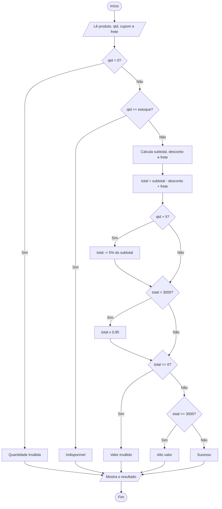
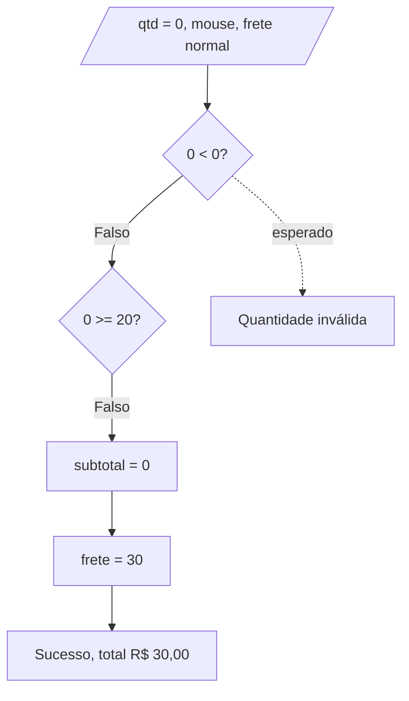
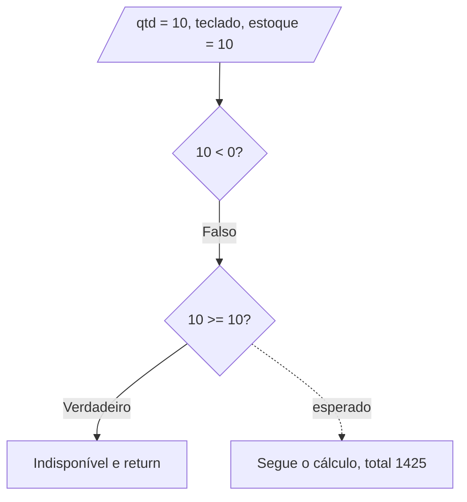
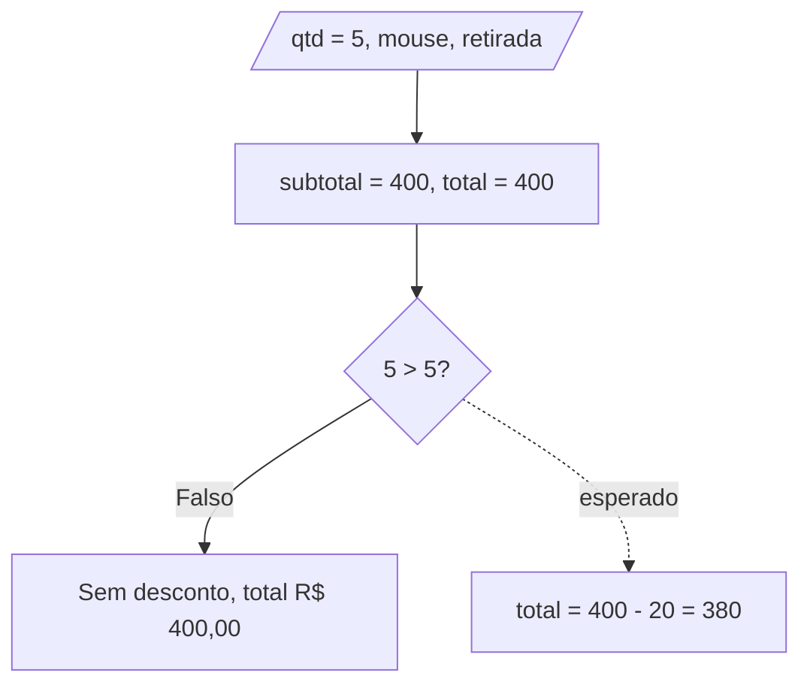
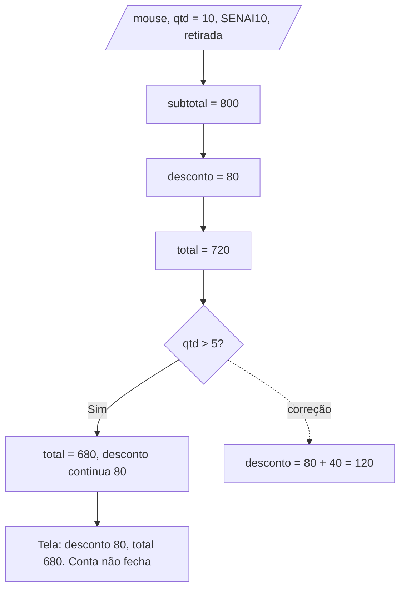
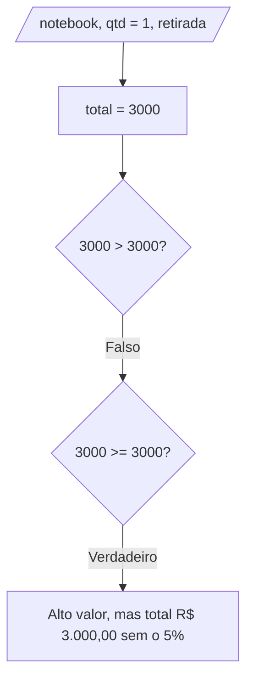
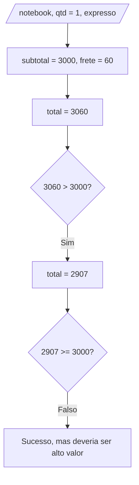

# Teste de Caixa Branca – Sistema de Pedidos

| | |
|---|---|
| **Instituição** | SENAI |
| **Curso** | Técnico em Desenvolvimento de Sistemas |
| **Unidade curricular** | SESI CE 356 |
| **Atividade** | Teste de Caixa Branca – Sistema de Pedidos |
| **Aluno** | Ítalo Mozer de Sousa |
| **Turma** | 3A |
| **Professores** | Robson, Reenye e Wellington |
| **Data** | 30/09/2026 |

---

## 1. Contextualização

No teste de caixa branca a gente olha o código por dentro, e não só o que entra e o que sai. Dá pra ver cada `if`, cada comparação e cada caminho que o programa pode seguir, e conferir se todos fazem o que deveriam. Isso ajuda a achar erros que só aparecem em casos específicos, tipo um valor exatamente no limite de uma regra.

O sistema analisado é uma página de pedidos: o usuário escolhe um produto, a quantidade, um cupom (opcional) e o frete. Ao clicar em "Calcular pedido" aparecem subtotal, desconto, frete e total. Toda a lógica está no `script.js`.

**Código original (com os erros):**

```js
const precos = {
  notebook: 3000,
  mouse: 80,
  teclado: 150
};

const estoque = {
  notebook: 5,
  mouse: 20,
  teclado: 10
};

const produto = document.getElementById("produto");
const quantidade = document.getElementById("quantidade");
const cupom = document.getElementById("cupom");
const frete = document.getElementById("frete");
const calcular = document.getElementById("calcular");
const resultado = document.getElementById("resultado");

function calcularDesconto(subtotal, codigo) {
  if (codigo === "SENAI10") {
    return subtotal * 0.10;
  }

  if (codigo === "SENAI20" && subtotal >= 1000) {
    return subtotal * 0.20;
  }

  return 0;
}

function calcularFrete(tipo, subtotal) {
  if (tipo === "retirada") {
    return 0;
  }

  if (tipo === "expresso") {
    return 60;
  }

  if (subtotal >= 500) {
    return 0;
  }

  return 30;
}

function finalizarPedido() {
  const produtoSelecionado = produto.value;
  const qtd = Number(quantidade.value);
  const codigo = cupom.value.trim().toUpperCase();

  if (qtd < 0) {
    resultado.innerHTML = "<p>Quantidade inválida.</p>";
    return;
  }

  if (qtd >= estoque[produtoSelecionado]) {
    resultado.innerHTML = "<p>Quantidade indisponível em estoque.</p>";
    return;
  }

  const subtotal = precos[produtoSelecionado] * qtd;
  const desconto = calcularDesconto(subtotal, codigo);
  const valorFrete = calcularFrete(frete.value, subtotal);

  let total = subtotal - desconto + valorFrete;

  if (qtd > 5) {
    total = total - subtotal * 0.05;
  }

  if (total > 3000) {
    total = total * 0.95;
  }

  let mensagem = "Pedido calculado com sucesso.";

  if (total <= 0) {
    mensagem = "Valor do pedido inválido.";
  } else if (total >= 3000) {
    mensagem = "Pedido de alto valor.";
  }

  resultado.innerHTML = `
    <p>${mensagem}</p>
    <p>Subtotal: R$ ${subtotal.toFixed(2)}</p>
    <p>Desconto: R$ ${desconto.toFixed(2)}</p>
    <p>Frete: R$ ${valorFrete.toFixed(2)}</p>
    <p class="total">Total: R$ ${total.toFixed(2)}</p>
  `;
}

calcular.addEventListener("click", finalizarPedido);
```

**O que eu considero o comportamento correto:**

- Quantidade: inteiro maior que zero.
- Estoque: pode pedir até o total em estoque, inclusive.
- Cupom `SENAI10`: 10% de desconto. `SENAI20`: 20%, só com subtotal a partir de R$ 1.000.
- Desconto por quantidade: 5% a partir de 5 unidades.
- Frete: retirada grátis, expresso R$ 60, normal R$ 30 (grátis com subtotal a partir de R$ 500).
- Alto valor: total a partir de R$ 3.000 ganha 5% extra e a mensagem "Pedido de alto valor".
- Na tela, subtotal − desconto + frete tem que dar o total.

---

## 2. Estruturas de decisão

Só tem `if` no código (sem `switch`, ternário ou laço). O único operador lógico é o `&&` do cupom SENAI20.

| # | Onde | Condição | Verdadeiro | Falso |
|---|---|---|---|---|
| D1 | `calcularDesconto` | `codigo === "SENAI10"` | 10% | vai pra D2 |
| D2 | `calcularDesconto` | `codigo === "SENAI20" && subtotal >= 1000` | 20% | sem desconto |
| D3 | `calcularFrete` | `tipo === "retirada"` | R$ 0 | vai pra D4 |
| D4 | `calcularFrete` | `tipo === "expresso"` | R$ 60 | vai pra D5 |
| D5 | `calcularFrete` | `subtotal >= 500` | R$ 0 | R$ 30 |
| D6 | `finalizarPedido` | `qtd < 0` | "Quantidade inválida" | vai pra D7 |
| D7 | `finalizarPedido` | `qtd >= estoque` | "Indisponível" | segue o cálculo |
| D8 | `finalizarPedido` | `qtd > 5` | aplica 5% | não aplica |
| D9 | `finalizarPedido` | `total > 3000` | aplica 5% extra | não aplica |
| D10 | `finalizarPedido` | `total <= 0` | "Valor inválido" | vai pra D11 |
| D11 | `finalizarPedido` | `total >= 3000` | "Alto valor" | "Sucesso" |

---

## 3. Fluxograma geral



---

## 4. Casos de teste

| ID | Entrada | Caminho | Esperado |
|---|---|---|---|
| CT01 | Mouse, qtd 0, sem cupom, frete normal | D6 falso | "Quantidade inválida" |
| CT02 | Teclado, qtd 10, sem cupom, retirada | D7 no limite | Aceito, total R$ 1.425,00 |
| CT03 | Mouse, qtd 5, sem cupom, retirada | D8 no limite | Desconto R$ 20,00, total R$ 380,00 |
| CT04 | Mouse, qtd 10, SENAI10, retirada | D1 e D8 verdadeiros | Desconto R$ 120,00, total R$ 680,00 |
| CT05 | Notebook, qtd 1, sem cupom, retirada | D9 e D11 com total = 3000 | 5% extra, total R$ 2.850,00, "Alto valor" |
| CT06 | Notebook, qtd 1, sem cupom, expresso | D9 verdadeiro, depois D11 | "Alto valor", total R$ 2.907,00 |

---

## 5. Resultados dos testes

Rodei os casos em Node.js com a mesma lógica do `script.js`, antes e depois das correções.

**Antes:**

| Teste | Esperado | Obtido | Situação |
|---|---|---|---|
| CT01 | Quantidade inválida | Sucesso, total R$ 30,00 | Falhou |
| CT02 | Aceito, R$ 1.425,00 | "Indisponível em estoque" | Falhou |
| CT03 | R$ 380,00 | R$ 400,00 | Falhou |
| CT04 | Desconto R$ 120,00 | Desconto R$ 80,00 | Falhou |
| CT05 | R$ 2.850,00 | R$ 3.000,00 | Falhou |
| CT06 | Alto valor | "Sucesso" (R$ 2.907,00) | Falhou |

**Depois:**

| Teste | Obtido | Situação |
|---|---|---|
| CT01 | "Quantidade inválida." | Passou |
| CT02 | Total R$ 1.425,00 | Passou |
| CT03 | Desconto R$ 20,00, total R$ 380,00 | Passou |
| CT04 | Desconto R$ 120,00, total R$ 680,00 | Passou |
| CT05 | Total R$ 2.850,00, "Alto valor" | Passou |
| CT06 | Total R$ 2.907,00, "Alto valor" | Passou |

---

## 6. Análise dos resultados

### ERRO 1

**Nível:** Fácil (valores-limite)

**Trecho:**
```js
if (qtd < 0) {
```

**Esperado:** quantidade 0, vazia ou decimal deveria ser recusada.

**Dados:** mouse, qtd 0, sem cupom, frete normal.

**Caminho:** D6 (`0 < 0`) é falso, D7 (`0 >= 20`) é falso. Subtotal 0, e como `0 >= 500` é falso, o frete fica 30. Total 30, cai em "Sucesso".

**Resultado esperado:** "Quantidade inválida".

**Resultado obtido:** "Sucesso", total R$ 30,00 (frete cobrado por zero itens).

**Erro:** o limite está errado. Com `< 0` o próprio zero passa.

**Correção:**
```js
if (!Number.isInteger(qtd) || qtd <= 0) {
```

**Depois da correção:** "Quantidade inválida".



---

### ERRO 2

**Nível:** Fácil (valores-limite)

**Trecho:**
```js
if (qtd >= estoque[produtoSelecionado]) {
```

**Esperado:** com 10 teclados em estoque, dá pra comprar os 10.

**Dados:** teclado, qtd 10, sem cupom, retirada.

**Caminho:** D6 falso. D7 (`10 >= 10`) verdadeiro, então mostra "indisponível" e dá `return`.

**Resultado esperado:** pedido aceito, total R$ 1.425,00.

**Resultado obtido:** "Quantidade indisponível em estoque".

**Erro:** o `>=` bloqueia justamente o pedido que usa todo o estoque. O certo é `>`.

**Correção:**
```js
if (qtd > estoque[produtoSelecionado]) {
```

**Depois da correção:** pedido aceito, R$ 1.425,00. Com qtd 11 continua bloqueando.



---

### ERRO 3

**Nível:** Médio (valores-limite)

**Trecho:**
```js
if (qtd > 5) {
  total = total - subtotal * 0.05;
}
```

**Esperado:** desconto de 5% a partir de 5 unidades.

**Dados:** mouse, qtd 5, sem cupom, retirada.

**Caminho:** subtotal 400, desconto 0, frete 0, total 400. D8 (`5 > 5`) é falso, então não aplica o desconto.

**Resultado esperado:** desconto R$ 20,00, total R$ 380,00.

**Resultado obtido:** total R$ 400,00.

**Erro:** o `>` deixa de fora justamente a quantidade que começa a faixa. O certo é `>=`.

**Correção:**
```js
const QTD_MINIMA_DESCONTO = 5;

if (qtd >= QTD_MINIMA_DESCONTO) {
  desconto += subtotal * 0.05;
}
```

**Depois da correção:** total R$ 380,00. Com 4 unidades continua sem desconto.



---

### ERRO 4

**Nível:** Médio (rastreamento de variáveis)

**Trecho:**
```js
const desconto = calcularDesconto(subtotal, codigo);
let total = subtotal - desconto + valorFrete;

if (qtd > 5) {
  total = total - subtotal * 0.05;
}
```

**Esperado:** o desconto mostrado na tela deve somar cupom e quantidade, pra conta fechar.

**Dados:** mouse, qtd 10, SENAI10, retirada.

**Caminho:** subtotal 800. Em D1 o desconto vira 80. Total = 800 − 80 = 720. Em D8 (`10 > 5`) o total cai para 680, mas a variável `desconto` continua 80.

**Resultado esperado:** desconto R$ 120,00 (80 + 40), total R$ 680,00.

**Resultado obtido:** desconto R$ 80,00, total R$ 680,00. Na tela, 800 − 80 não dá 680.

**Erro:** o desconto por quantidade mexe direto no `total` e nunca entra na variável `desconto`, então o valor exibido fica diferente do aplicado.

**Correção:**
```js
let desconto = calcularDesconto(subtotal, codigo);

if (qtd >= QTD_MINIMA_DESCONTO) {
  desconto += subtotal * 0.05;
}

const totalParcial = subtotal - desconto + valorFrete;
```

**Depois da correção:** desconto R$ 120,00, total R$ 680,00.



---

### ERRO 5

**Nível:** Difícil (análise de condições)

**Trecho:**
```js
if (total > 3000) {
  total = total * 0.95;
}

if (total <= 0) {
  mensagem = "Valor do pedido inválido.";
} else if (total >= 3000) {
  mensagem = "Pedido de alto valor.";
}
```

**Esperado:** o mesmo limite (a partir de R$ 3.000) vale para o desconto extra e para a mensagem.

**Dados:** notebook, qtd 1, sem cupom, retirada (total = 3000).

**Caminho:** D9 (`3000 > 3000`) é falso, sem desconto extra. D10 falso. D11 (`3000 >= 3000`) verdadeiro, mensagem "Alto valor".

**Resultado esperado:** "Alto valor" com o 5% extra, total R$ 2.850,00.

**Resultado obtido:** "Alto valor" com total R$ 3.000,00.

**Erro:** duas decisões usam o mesmo limite com operadores diferentes (`>` e `>=`). Em 3000 o pedido é "alto valor" mas não ganha o benefício.

**Correção:**
```js
const LIMITE_ALTO_VALOR = 3000;

const altoValor = totalParcial >= LIMITE_ALTO_VALOR;
```

**Depois da correção:** total R$ 2.850,00 e "Pedido de alto valor".



---

### ERRO 6

**Nível:** Difícil (análise de caminhos)

**Trecho:** o mesmo bloco do Erro 5.

**Esperado:** classificar como alto valor olhando o total antes do desconto extra.

**Dados:** notebook, qtd 1, sem cupom, frete expresso.

**Caminho:** subtotal 3000, frete 60, total 3060. D9 (`3060 > 3000`) verdadeiro, total vira 3060 × 0,95 = 2907. D10 falso. D11 (`2907 >= 3000`) falso, mensagem "Sucesso".

**Resultado esperado:** "Pedido de alto valor", total R$ 2.907,00.

**Resultado obtido:** "Pedido calculado com sucesso", total R$ 2.907,00.

**Erro:** ordem das operações. O desconto extra diminui o `total`, e logo depois a mesma variável é usada pra classificar o pedido. Pedidos entre R$ 3.000 e cerca de R$ 3.157,89 perdem a classificação.

**Correção:**
```js
const altoValor = totalParcial >= LIMITE_ALTO_VALOR;
const descontoAltoValor = altoValor ? totalParcial * 0.05 : 0;
const total = totalParcial - descontoAltoValor;

if (total <= 0) {
  mensagem = "Valor do pedido inválido.";
} else if (altoValor) {
  mensagem = "Pedido de alto valor.";
}
```

**Depois da correção:** "Pedido de alto valor", total R$ 2.907,00.



---

### Comparação antes e depois

| Erro | Nível | Antes | Depois |
|---|---|---|---|
| 1 | Fácil | Aceitava qtd 0 e cobrava frete | Recusa 0, vazio e decimal |
| 2 | Fácil | Bloqueava pedido igual ao estoque | Aceita até o estoque |
| 3 | Médio | 5 unidades sem desconto | Desconto a partir de 5 |
| 4 | Médio | Desconto na tela não fechava com o total | Desconto soma cupom e quantidade |
| 5 | Difícil | `>` e `>=` divergiam em 3000 | Mesmo limite nos dois lugares |
| 6 | Difícil | Perdia "alto valor" depois do desconto | Classifica antes do desconto |

### Código corrigido

```js
const LIMITE_ALTO_VALOR = 3000;
const QTD_MINIMA_DESCONTO = 5;

const precos = {
  notebook: 3000,
  mouse: 80,
  teclado: 150
};

const estoque = {
  notebook: 5,
  mouse: 20,
  teclado: 10
};

const produto = document.getElementById("produto");
const quantidade = document.getElementById("quantidade");
const cupom = document.getElementById("cupom");
const frete = document.getElementById("frete");
const calcular = document.getElementById("calcular");
const resultado = document.getElementById("resultado");

function calcularDesconto(subtotal, codigo) {
  if (codigo === "SENAI10") {
    return subtotal * 0.10;
  }

  if (codigo === "SENAI20" && subtotal >= 1000) {
    return subtotal * 0.20;
  }

  return 0;
}

function calcularFrete(tipo, subtotal) {
  if (tipo === "retirada") {
    return 0;
  }

  if (tipo === "expresso") {
    return 60;
  }

  if (subtotal >= 500) {
    return 0;
  }

  return 30;
}

function finalizarPedido() {
  const produtoSelecionado = produto.value;
  const qtd = Number(quantidade.value);
  const codigo = cupom.value.trim().toUpperCase();

  if (!Number.isInteger(qtd) || qtd <= 0) {
    resultado.innerHTML = "<p>Quantidade inválida.</p>";
    return;
  }

  if (qtd > estoque[produtoSelecionado]) {
    resultado.innerHTML = "<p>Quantidade indisponível em estoque.</p>";
    return;
  }

  const subtotal = precos[produtoSelecionado] * qtd;
  let desconto = calcularDesconto(subtotal, codigo);

  if (qtd >= QTD_MINIMA_DESCONTO) {
    desconto += subtotal * 0.05;
  }

  const valorFrete = calcularFrete(frete.value, subtotal);
  const totalParcial = subtotal - desconto + valorFrete;

  const altoValor = totalParcial >= LIMITE_ALTO_VALOR;
  const descontoAltoValor = altoValor ? totalParcial * 0.05 : 0;
  const total = totalParcial - descontoAltoValor;

  let mensagem = "Pedido calculado com sucesso.";

  if (total <= 0) {
    mensagem = "Valor do pedido inválido.";
  } else if (altoValor) {
    mensagem = "Pedido de alto valor.";
  }

  resultado.innerHTML = `
    <p>${mensagem}</p>
    <p>Subtotal: R$ ${subtotal.toFixed(2)}</p>
    <p>Desconto: R$ ${desconto.toFixed(2)}</p>
    ${altoValor ? `<p>Desconto alto valor: R$ ${descontoAltoValor.toFixed(2)}</p>` : ""}
    <p>Frete: R$ ${valorFrete.toFixed(2)}</p>
    <p class="total">Total: R$ ${total.toFixed(2)}</p>
  `;
}

calcular.addEventListener("click", finalizarPedido);
```

---

## 7. Conclusão

Dá pra ver que um código pode rodar sem travar e mesmo assim estar errado. Os seis erros não quebram o sistema, ele sempre mostra um resultado com cara de normal. Só aparece o problema quando a gente acompanha o valor de cada variável e a decisão que o programa tomou em cada `if`.

Quatro erros foram de valor-limite (`<`, `>=` e `>` no lugar errado), um foi de desconto exibido diferente do aplicado e um foi de ordem das operações, onde uma decisão muda o valor que a próxima usa. Esse último foi o mais difícil de achar, e o fluxograma ajudou a enxergar o caminho.

Os seis casos falharam antes da correção e passaram depois, então agora o sistema segue as regras definidas.